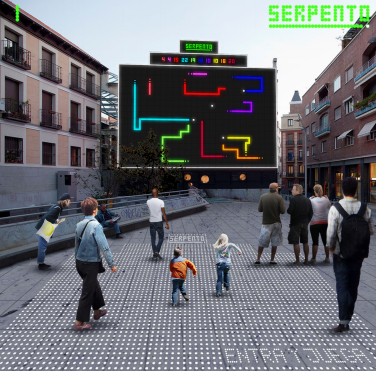

Serpento
============

Autores
------------
* Cristóbal Baños (www.hyperstudio.es)
* Diego Iglesias (www.hyperstudio.es)
 
Colaboradores
------------

Introducción
------------
SERPENTO es una versión multijugador, masiva y urbana del “snake”. Una reinterpretación de uno de los juegos de arcade más míticos de la cultura digital, que escapa del autismo de nuestros dispositivos para ocupar la gran pantalla de Medialab Prado y su plaza.

Frente al carácter individual del “snake”, SERPENTO es un juego para muchos. De hecho, cuantos más, mejor! Cada persona que entre en la plaza se convertirá en una réplica virtual de sí mismo. Los serpenteos analógicos de cada individuo por el plano físico se trasladarán a la posición virtual de una nueva serpiente en la pantalla. Así, uno estará a la vez en la plaza y en la pantalla. La plaza se convierte en la pantalla y, la pantalla, en la plaza.

Es precisamente en esta hibridación entre lo físico y lo virtual donde surge la acción social. Ya no estamos solos enfrentándonos a nosotros mismos, sino que las personas que nos rodean son las que componen el paisaje de obstáculos, posibles aliados y objetivos comunes que convierten nuestro paso por la plaza en una experiencia diferente. Un juego sin principio ni final ni límites al que cada persona que quiera puede unirse en cualquier momento.

La materialidad de la plaza se ve afectada por el juego, instalando una serie de marcas y señales que transforman el pavimento en aumentado, implementando las instrucciones y otras funciones del juego en el mismo. SERPENTO coloniza no solo la pantalla, sino también la plaza. 
